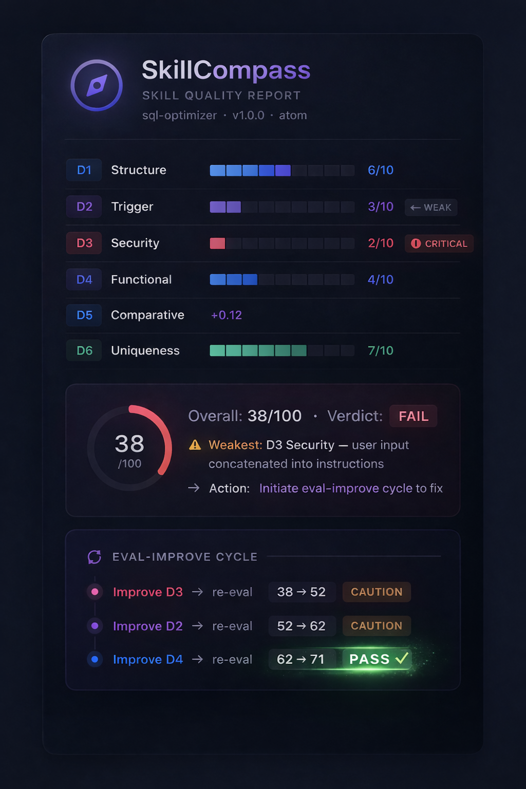

# SkillCompass

**Your skill could be much better. But better *how*? Which part? In what order?**

[GitHub](https://github.com/Evol-ai/SkillCompass) | [SKILL.md](SKILL.md) | [Schemas](schemas/)

---

- **What it is:** An evaluation-driven skill evolution engine for Claude Code / OpenClaw skill packages — six-dimension scoring, directed improvement, version management.
- **Pain it solves:** Turns "tweak and hope" into diagnose → targeted fix → verified improvement.
- **Use in 30 seconds:** `/eval-skill .claude/skills/my-skill/SKILL.md` — instant six-dimension quality report showing exactly what's weakest and what to do next.

> Find the weakest link → fix it → prove it worked → next weakness → repeat.

---

## Who This Is For / Not For

### For

- Anyone maintaining agent skills in Claude Code or OpenClaw and wanting measurable quality
- Developers who want directed improvement for existing skills — not guesswork, but knowing exactly which dimension to fix next
- Teams and individuals who need a quality gate — when any tool (Auto-Updater, Claudeception, Self-Improving Agent, or your own pipeline) edits or updates a skill, SkillCompass automatically evaluates the change

### Not For

- General code review or runtime debugging
- Creating new skills from scratch (use skill-creator)
- Evaluating non-skill files

---

## Quick Start

**Prerequisites:**
- **Claude Opus 4.6** — the six-dimension rubric requires complex reasoning and consistent scoring. Sonnet/Haiku may produce unreliable results.
- **Node.js v18+** — local validators and hooks depend on it.

### Claude Code

```bash
# 1. Clone and install dependencies
git clone https://github.com/Evol-ai/SkillCompass.git
cd SkillCompass && npm install

# 2. Install to user-level (all projects) or project-level (current project only)
cp -r SkillCompass/ ~/.claude/skills/SkillCompass/
# or
cp -r SkillCompass/ .claude/skills/SkillCompass/
```

> First run will ask permission for `node -e` and `bash`. Select "Allow always".

### OpenClaw

```bash
git clone https://github.com/Evol-ai/SkillCompass.git
cd SkillCompass && npm install
mkdir -p ~/.openclaw/workspace/skills/skill-compass
cp -r ./* ~/.openclaw/workspace/skills/skill-compass/
openclaw gateway restart
```

### Usage

Two ways to invoke SkillCompass:

#### Way 1: Slash command + natural language

Type `/skill-compass` followed by what you want in plain language:

```
/skill-compass evaluate ./my-skill/SKILL.md
/skill-compass improve the nano-banana skill
/skill-compass security scan ./my-skill/SKILL.md
/skill-compass audit all skills in .claude/skills/
/skill-compass compare my-skill 1.0.0 vs 1.0.0-evo.2
/skill-compass roll back my-skill to previous version
```

#### Way 2: Just talk to Claude

No slash command needed — Claude automatically recognizes the intent:

```
Evaluate the nano-banana skill for me
Review the quality of ./my-skill/SKILL.md
Improve this skill — fix the weakest dimension
Scan all skills in .claude/skills/ for security issues
```

#### Capability reference

| Intent | Maps to |
|--------|---------|
| Evaluate / score / review a skill | `eval-skill` |
| Improve / fix / upgrade a skill | `eval-improve` |
| Security scan a skill | `eval-security` |
| Batch audit a directory | `eval-audit` |
| Compare two versions | `eval-compare` |
| Merge with upstream | `eval-merge` |
| Rollback to previous version | `eval-rollback` |

---

## What It Does



The score isn't the point — **the direction is.** You instantly see which dimension is the bottleneck and what to do about it.

Each `/eval-improve` round follows a closed loop: **fix the weakest → re-evaluate → verify improvement → next weakest**. No fix is saved unless the re-evaluation confirms it actually helped.

---

## Six-Dimension Evaluation Model

| ID | Dimension | Weight | What it evaluates |
|----|-----------|--------|-------------------|
| D1 | Structure | 10% | Frontmatter validity, markdown format, declarations |
| D2 | Trigger | 15% | Activation quality — command, hook, glob, or description triggers |
| D3 | Security | 20% | Gate dimension — secrets, injection, permissions, exfiltration. Critical = auto FAIL |
| D4 | Functional | 30% | Core quality, edge cases, output stability, error handling |
| D5 | Comparative | 15% | Value over direct prompting (with vs without skill) |
| D6 | Uniqueness | 10% | Overlap with similar skills, model supersession risk |

```
overall_score = round((D1×0.10 + D2×0.15 + D3×0.20 + D4×0.30 + D5×0.15 + D6×0.10) × 10)
```

- **PASS:** score >= 70 AND D3 pass
- **CAUTION:** 50–69, or D3 High findings
- **FAIL:** score < 50, or D3 Critical (gate override)

---

## Features

### Core Loop

- **Directed Evolution.** Diagnose → targeted fix → verify → next weakness. Not random patching.
- **Closed-Loop Improve.** `/eval-improve` auto re-evaluates after each fix. Only saves if the target improved and nothing regressed. Fails? Auto-discard.
- **Scope Control.** `--scope gate` = D1+D3 only (~8K tokens). `--scope target --dimension D4` = single dimension + security gate. Full eval when you need the whole picture.
- **Tiered Verification.** Edit scope auto-classified: L0 syntax → L1 single dimension → L2 full re-eval → L3 cross-skill. Small edits get quick checks.
- **D1+D2 Grouping.** Both metadata dimensions weak (<=5)? Improved together in one round — they share the frontmatter layer.

### Safety

- **Pre-Accept Gate.** Hooks watch every SKILL.md write. D1 structure + D3 security scan fires automatically. Zero config. Warns, never blocks.
- **Pre-Eval Scan.** Static analysis catches malicious code, exfiltration, prompt injection, and high-entropy strings before anything hits the LLM.
- **Output Guard.** Validates `/eval-improve` output for URL injection, dangerous commands, scope mismatch, and size anomalies before writing.
- **Auto-Rollback.** Any dimension drops >2 points after improvement? Changes discarded.
- **Local Validators.** JS-based D1/D2/D3 validators run locally before LLM eval. Saves ~60% tokens on clear-cut issues.

### Smart Optimization

- **Correction Tracking.** Detects repeated manual fixes, maps them to dimensions, prompts skill update at next invocation.
- **Feedback Signal Integration.** Real usage data (trigger accuracy, corrections, adoption rate) fuses into scores: 60% static + 40% feedback.
- **Multi-Language Triggers.** Detects your working language, tests trigger accuracy in it, fixes multilingual gaps.
- **Obsolescence Detection (D6).** Compares skill vs base model output. Tracks supersession risk across model updates.
- **Skill Type Detection.** Auto-classifies atom / composite / meta. Evaluation adapts accordingly.

### Version & Scale

- **Version Management.** SHA-256 hashed snapshots. Rollback to any version anytime.
- **Three-Way Merge.** `/eval-merge` merges upstream updates by region — frontmatter field-by-field, instructions paragraph-by-paragraph, code blocks as units. Local improvements preserved. Post-merge eval ensures no regression.
- **Multi-Round Evolution.** `/eval-evolve` runs up to 6 rounds autonomously. Stops at PASS or plateau.
- **Batch Audit + Auto-Fix.** `/eval-audit --fix --budget 3` scans a directory, worst-first, auto-fixes within budget.
- **CI Mode.** `--ci` flag, exit codes: 0=PASS, 1=CAUTION, 2=FAIL.

---

## Works With Everything

No point-to-point integration needed. The Pre-Accept Gate intercepts all SKILL.md edits regardless of source.

| Tool | How it works together | Guide |
|------|----------------------|-------|
| **Auto-Updater** | Pulls new version → Gate auto-checks for security regressions → you decide to keep or rollback | [guide-auto-updater.md](examples/guide-auto-updater.md) |
| **Claudeception** | Extracts skill from session → auto-evaluation catches security holes + redundancy → directed fix | [guide-claudeception.md](examples/guide-claudeception.md) |
| **Self-Improving Agent** | Logs errors to `.learnings/` → feed as signals → SkillCompass maps to dimensions and fixes | [guide-self-improving-agent.md](examples/guide-self-improving-agent.md) |

---

## Feedback Signal Standard

SkillCompass defines an open `feedback-signal.json` schema for any tool to report skill usage data:

```bash
/eval-skill ./my-skill/SKILL.md --feedback ./feedback-signals.json
```

Signals include: `trigger_accuracy`, `correction_count`, `correction_patterns`, `adoption_rate`, `ignore_rate`, `usage_frequency`. The schema is extensible (`additionalProperties: true`) — Claudeception, AutoSkill, ClawHub, or your own pipeline can produce or consume this format.

---

## License

**MIT** — Use, modify, distribute freely. No requirement to open-source modifications. See [LICENSE](LICENSE) for details.
